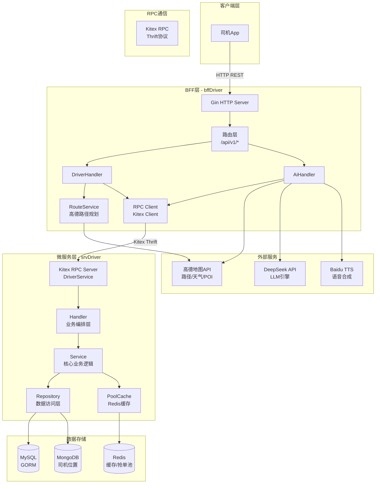
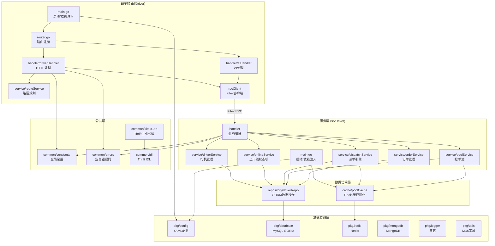
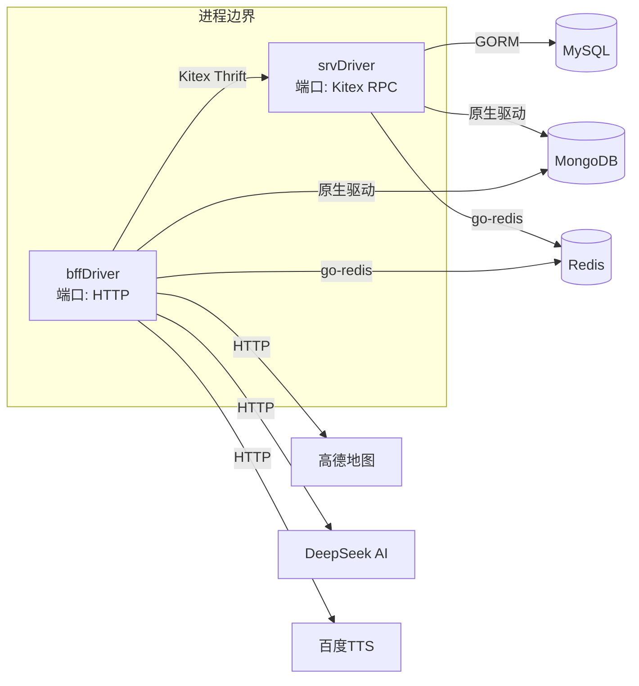
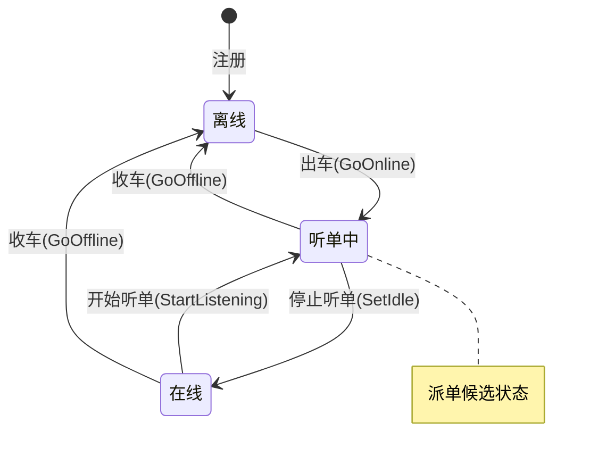
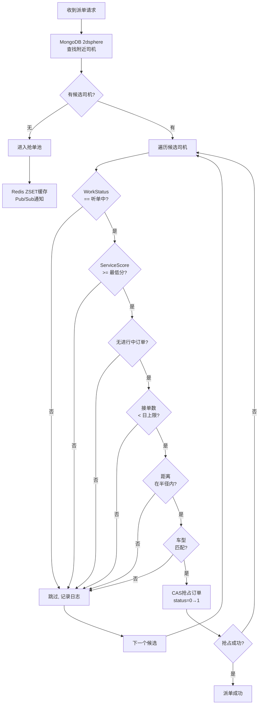
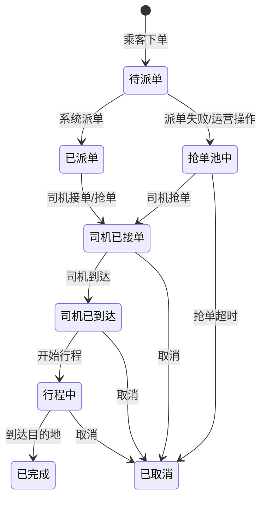
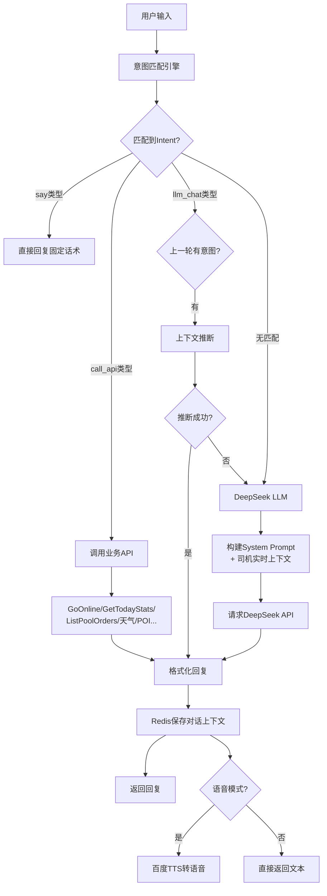
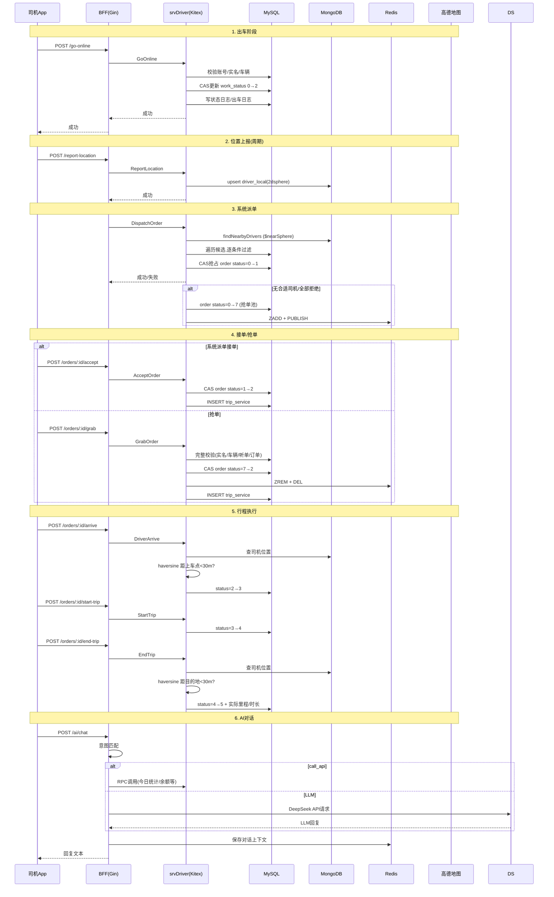
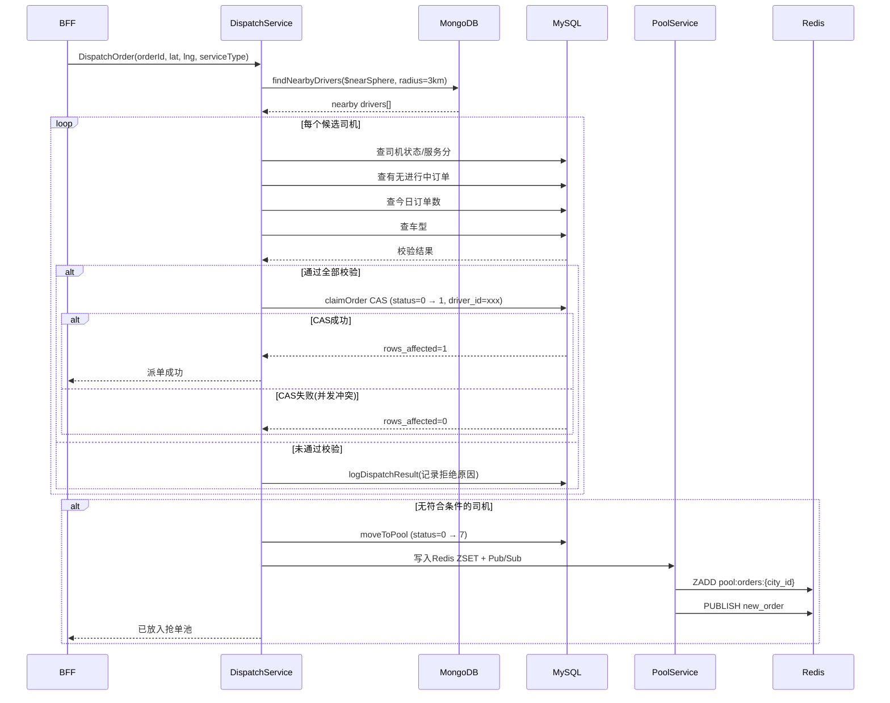
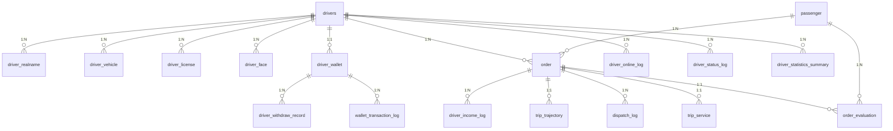

# 花小猪打车 - 司机端系统架构分析与答辩准备文档

> 项目名称：花小猪打车司机端  
> 技术栈：Go 1.26 + Kitex + Gin + GORM + Redis + MongoDB + MySQL + 高德地图API + DeepSeek + 百度TTS  
> 生成日期：2026-05-11

---

## 目录

1. [项目概述](#1-项目概述)
2. [整体架构图](#2-整体架构图)
3. [服务分层架构](#3-服务分层架构)
4. [核心业务流程](#4-核心业务流程)
5. [数据库设计](#5-数据库设计)
6. [关键技术选型](#6-关键技术选型)
7. [设计亮点与难点](#7-设计亮点与难点)
8. [答辩常见问题与答案](#8-答辩常见问题与答案)

---

## 1. 项目概述

### 1.1 项目定位

花小猪打车司机端系统，是一个面向网约车司机的综合服务平台，提供从司机注册认证、出车/收车、实时位置上报、智能派单/抢单、行程管理、收入结算到AI智能助手的全链路服务。

### 1.2 核心功能模块

| 模块 | 功能描述 |
|------|----------|
| **司机管理** | 司机注册、信息维护、CRUD |
| **认证体系** | 实名认证、驾驶证认证、车辆认证、人脸验证 |
| **司机上下线** | 状态机管理：离线 → 在线 → 听单中 |
| **实时位置** | GPS上报，MongoDB 2dsphere地理空间索引 |
| **智能派单** | 基于多条件过滤 + CAS抢占的派单引擎 |
| **抢单池** | 派单失败后订单自动进池，司机可抢单 |
| **订单生命周期** | 派单→接单→到达→行程→完成/取消 |
| **路径规划** | 高德地图行车路线规划 |
| **AI数字人** | DeepSeek LLM + 意图路由 + 业务API集成 |
| **语音助手** | 百度TTS语音播报 |
| **生活服务** | 天气查询、附近加油站/充电桩/厕所/停车场/美食 |

### 1.3 技术栈总览

| 技术 | 用途 |
|------|------|
| Go 1.26 | 开发语言 |
| Kitex v0.16.1 | RPC框架（CloudWeGo企业级框架） |
| Gin v1.12 | HTTP框架（BFF层） |
| Thrift | 接口定义语言（IDL） |
| MySQL + GORM | 关系型数据库 + ORM |
| Redis (go-redis) | 缓存 + 抢单池ZSET + 消息发布(Pub/Sub) |
| MongoDB | 司机实时位置存储（2dsphere地理索引） |
| 高德地图API | 路径规划、天气查询、POI搜索、逆地理编码 |
| DeepSeek API | AI对话引擎 |
| 百度TTS | 文本转语音 |

---

## 2. 整体架构图

### 2.1 系统架构总览



### 2.2 分层架构图



### 2.3 模块依赖关系图



---

## 3. 服务分层架构

### 3.1 BFF层 (bffDriver)

BFF层是面向司机App的HTTP API网关，采用Gin框架，负责请求路由、参数校验、外部服务集成和RPC调用转发。

**核心组件：**

| 组件 | 文件 | 职责 |
|------|------|------|
| main.go | `bffDriver/cmd/main.go` | 启动入口，初始化配置、Redis、MongoDB、RPC客户端 |
| router.go | `bffDriver/internal/router/router.go` | 路由注册 |
| DriverHandler | `bffDriver/internal/handler/driverHandler.go` | 司机和订单相关HTTP接口 |
| AiHandler | `bffDriver/internal/handler/aiHandler.go` | AI对话、天气、POI、TTS |
| RouteService | `bffDriver/internal/service/routeService.go` | 高德地图路径规划 |
| DriverClient | `bffDriver/internal/rpcClient/driverClient.go` | Kitex RPC客户端封装 |

**HTTP API 路由：**

```
# 司机管理
GET    /api/v1/drivers                        # 司机列表
GET    /api/v1/drivers/:id                     # 司机详情
POST   /api/v1/drivers                         # 创建司机
PUT    /api/v1/drivers/:id                     # 更新司机
DELETE /api/v1/drivers/:id                     # 删除司机

# 司机上下线
POST   /api/v1/drivers/:id/go-online           # 出车上线
POST   /api/v1/drivers/:id/set-idle            # 停止听单
POST   /api/v1/drivers/:id/start-listening     # 开始听单
POST   /api/v1/drivers/:id/go-offline          # 收车下线
POST   /api/v1/drivers/:id/report-location     # 位置上报

# 派单/接单
POST   /api/v1/orders/dispatch                 # 派单
POST   /api/v1/orders/:id/accept               # 接单
POST   /api/v1/orders/:id/reject               # 拒单
POST   /api/v1/orders/:id/cancel               # 取消
POST   /api/v1/orders/:id/arrive               # 到达
POST   /api/v1/orders/:id/verify-passenger     # 验证乘客
POST   /api/v1/orders/:id/start-trip           # 开始行程
POST   /api/v1/orders/:id/end-trip             # 结束行程

# 抢单池
POST   /api/v1/pool/list                       # 查看抢单池
POST   /api/v1/orders/:id/grab                 # 抢单

# 订单查询
GET    /api/v1/drivers/:id/orders              # 订单列表
GET    /api/v1/orders/:id/detail               # 订单详情

# 路径规划
POST   /api/v1/route/plan                      # 路线规划

# AI
POST   /api/v1/ai/chat                         # AI对话
POST   /api/v1/ai/voice-chat                   # 语音对话
GET    /api/v1/ai/tts                          # 文本转语音
```

### 3.2 服务层 (srvDriver)

服务层是RPC微服务，采用Kitex框架，通过Thrift协议对外提供服务，包含全部核心业务逻辑。

**服务接口定义 (Thrift IDL)：**

```thrift
service DriverService {
    // 司机管理
    CreateDriverResp Create(1: CreateDriverReq req)
    GetDriverResp Get(1: GetDriverReq req)
    ListDriverResp List(1: ListDriverReq req)
    UpdateDriverResp Update(1: UpdateDriverReq req)
    DeleteDriverResp Delete(1: DeleteDriverReq req)
    
    // 上下线
    GoOnlineResp GoOnline(1: GoOnlineReq req)
    SetIdleResp SetIdle(1: SetIdleReq req)
    StartListeningResp StartListening(1: StartListeningReq req)
    GoOfflineResp GoOffline(1: GoOfflineReq req)
    ReportLocationResp ReportLocation(1: ReportLocationReq req)
    
    // 派单/接单
    DispatchOrderResp DispatchOrder(1: DispatchOrderReq req)
    AcceptOrderResp AcceptOrder(1: AcceptOrderReq req)
    RejectOrderResp RejectOrder(1: RejectOrderReq req)
    CancelOrderResp CancelOrder(1: CancelOrderReq req)
    DriverArriveResp DriverArrive(1: DriverArriveReq req)
    StartTripResp StartTrip(1: StartTripReq req)
    EndTripResp EndTrip(1: EndTripReq req)
    VerifyPassengerPhoneResp VerifyPassengerPhone(1: VerifyPassengerPhoneReq req)
    
    // 抢单池
    ListPoolOrdersResp ListPoolOrders(1: ListPoolOrdersReq req)
    GrabOrderResp GrabOrder(1: GrabOrderReq req)
    
    // 订单查询
    ListOrdersResp ListOrders(1: ListOrdersReq req)
    GetOrderResp GetOrder(1: GetOrderReq req)
    
    // 统计/钱包
    TodayStatsResp GetTodayStats(1: GetTodayStatsReq req)
    CurrentOrderResp GetCurrentOrder(1: GetCurrentOrderReq req)
    WalletResp GetWallet(1: GetWalletReq req)
}
```

**核心业务模块：**

#### DriverService - 司机管理服务
- Create / Get / List / Update / Delete 司机基本信息
- GetTodayStats: 查今日统计（订单数、收入、在线时长）
- GetWallet: 查钱包余额

#### OnlineService - 上下线状态机服务
- 司机工作状态三态转换：



- 上线校验：账号状态、实名认证、车辆认证
- CAS乐观锁更新：`UPDATE drivers SET work_status=? WHERE driver_id=? AND work_status=?`

#### DispatchService - 派单引擎
- 派单流程：



**派单过滤条件（按优先级）：**

| 条件 | 常量 | 说明 |
|------|------|------|
| C1 | DispatchNotListening (3001) | 司机必须在听单状态 |
| C2 | DispatchTooFar (3002) | 司机在派单半径内（可配置） |
| C3 | DispatchVehicleMismatch (3003) | 车型必须匹配 |
| C4 | DispatchHasOngoingOrder (3004) | 无进行中订单 |
| C5 | DispatchDailyLimit (3005) | 未达日接单上限 |
| C6 | DispatchLowScore (3006) | 服务分不低于最低阈值 |

#### PoolService - 抢单池服务
- 派单失败、无合适司机或所有司机拒绝时，订单自动进入抢单池
- 抢单池超时机制：默认30分钟超时
- 城市隔离：按city_id分区Redis ZSET
- Redis Pub/Sub通知新订单入池
- 抢单前校验：实名认证、车辆认证、听单状态、无进行中订单、日接单上限、订单状态=抢单池中、未超时、城市匹配

#### OrderService - 订单管理服务
- 订单查询（列表/详情）
- 订单状态流转：



### 3.3 AI数字人架构

AI数字人是项目的一大亮点，采用"意图路由 + LLM兜底"的混合架构：



**AI支持的API调用类型：**

| 意图 | API | 说明 |
|------|-----|------|
| 出车 | GoOnline | 上线接单 |
| 收车 | GoOffline | 收车下线 |
| 听单 | StartListening | 开始听单 |
| 今日接单 | GetTodayStats | 今日订单数和收入 |
| 余额查询 | GetWallet | 钱包余额 |
| 状态查询 | GetDriverStatus | 当前工作状态 |
| 当前订单 | GetCurrentOrder | 当前订单详情 |
| 服务分 | GetServiceScore | 服务评分 |
| 附近订单 | ListPoolOrders | 查看抢单池 |
| 抢单 | GrabPoolOrder | 抢单操作 |
| 天气查询 | QueryWeather | 高德天气API |
| 附近加油站 | QueryNearbyGas | 高德POI搜索 |
| 附近充电桩 | QueryNearbyCharger | 高德POI搜索 |
| 附近厕所 | QueryNearbyToilet | 高德POI搜索 |
| 附近美食 | QueryNearbyFood | 高德POI搜索 |
| 附近停车场 | QueryNearbyParking | 高德POI搜索 |
| 附近超市 | QueryNearbyMarket | 高德POI搜索 |
| 热点区域 | FindHotAreas | 高德POI搜索 |

**配置驱动设计：**
AI行为配置在 `digital_human.yaml` 中，支持热更新而无需改代码。包括：
- 角色定义（名字、语气、回复长度）
- 状态描述（各工作状态的中文描述）
- 意图路由规则（触发器、动作、API映射）
- 兜底System Prompt

---

## 4. 核心业务流程

### 4.1 全流程订单生命周期



### 4.2 派单引擎详细流程



---

## 5. 数据库设计

### 5.1 ER图（核心表）



### 5.2 核心表清单（26张表）

| # | 表名 | 说明 | 核心字段 |
|---|------|------|----------|
| 1 | `passenger` | 乘客基础信息 | passenger_id, mobile, nickname, level |
| 2 | `drivers` | 司机基础信息 | driver_id, mobile, nickname, work_status, service_score |
| 3 | `driver_realname` | 实名认证 | driver_id, real_name, id_card_no, status |
| 4 | `driver_license` | 驾驶证认证 | driver_id, license_no, drive_type, status |
| 5 | `driver_vehicle` | 车辆认证 | driver_id, plate_no, vehicle_model, service_type, status |
| 6 | `driver_vehicle_info` | 车辆详细信息 | driver_id, vin, engine_no, fuel_type |
| 7 | `driver_face` | 人脸信息 | driver_id, face_url, face_feature, status |
| 8 | `driver_face_auth_log` | 人脸核验记录 | driver_id, auth_type, similarity, status |
| 9 | `driver_status_log` | 状态变更日志 | driver_id, from_status, to_status, reason |
| 10 | `driver_level_config` | 等级配置 | level, min_score, max_score, commission_rate |
| 11 | `driver_level_record` | 等级变动记录 | driver_id, from_level, to_level, change_type |
| 12 | `driver_online_log` | 出车记录 | driver_id, online_time, offline_time, city_id |
| 13 | `driver_location_cache` | 位置缓存(已弃用) | driver_id, lat, lng, heading, speed |
| 14 | `dispatch_log` | 派单日志 | order_id, driver_id, dispatch_type, result |
| 15 | `order` | **订单主表** | order_id, status, driver_id, passenger_id, 费用字段 |
| 16 | `order_evaluation` | 订单评价 | order_id, driver_score, passenger_score |
| 17 | `trip_service` | 行程服务 | order_id, driver_id, accept_time ~ end_time |
| 18 | `trip_trajectory` | 行程轨迹 | trip_id, trajectory_data, point_count |
| 19 | `driver_wallet` | 司机钱包 | driver_id, balance, frozen_amount, version(乐观锁) |
| 20 | `driver_income_log` | 收入流水 | driver_id, order_id, amount, type |
| 21 | `wallet_transaction_log` | 钱包流水明细 | driver_id, transaction_no, amount, balance_before/after |
| 22 | `driver_withdraw_record` | 提现记录 | driver_id, amount, bank_name, status |
| 23 | `withdraw_record` | 提现记录(冗余) | driver_id, amount, status |
| 24 | `service_score_log` | 服务分变更 | driver_id, score_before, score_change, change_type |
| 25 | `driver_statistics_summary` | 司机统计汇总 | driver_id, stat_date, order_count, total_income |
| 26 | `pricing_rule_config` | 计费规则配置 | city_id, service_type, base_price, distance_price |

### 5.3 MongoDB集合

| 集合 | 说明 | 索引 |
|------|------|------|
| `driver_local` | 司机实时位置 | 2dsphere索引 on `loc` + `driver_id` 唯一索引 |

**位置文档结构：**
```json
{
    "driver_id": 10001,
    "lat": 39.9042,
    "lng": 116.4074,
    "status": 1,
    "city_id": 110000,
    "updated_at": 1715412345,
    "loc": {
        "type": "Point",
        "coordinates": [116.4074, 39.9042]
    }
}
```

---

## 6. 关键技术选型

### 6.1 为什么选择 Kitex（而不是 gRPC-Go）？

| 对比项 | Kitex | gRPC-Go |
|--------|-------|---------|
| **性能** | 基于Netpoll，零拷贝，更高吞吐 | 基于标准net/http2 |
| **协议** | Thrift（更轻量、更易调试） | Protobuf |
| **生成代码** | 更简洁，可读性强 | 生成代码较重 |
| **社区** | 字节跳动内部广泛使用 | CNCF主流 |
| **服务治理** | 内置丰富的治理能力 | 需要额外中间件 |

### 6.2 为什么使用 MongoDB 存司机位置？

MySQL不适合频繁的 **地理空间查询**（查找附近的司机），MongoDB 的 `2dsphere` 索引原生支持 `$nearSphere` 查询，性能远优于 MySQL。同时 MongoDB 的文档模型天然适合 JSON 格式的位置数据，无需预定义 Schema。

### 6.3 为什么用 Redis 做抢单池？

1. **ZSET排序**：天然支持按时间排序（订单进池时间）
2. **Pub/Sub**：实时广播新订单通知
3. **低延迟**：内存操作，毫秒级响应
4. **自动过期**：可与DB超时时间配合

### 6.4 CAS 乐观锁解决并发抢占

在多司机同时抢单/系统派单场景下，使用 **CAS (Compare-And-Swap)** 避免超卖：

```sql
-- 系统派单抢占
UPDATE order 
SET status = 1, driver_id = ? 
WHERE order_id = ? AND status = 0 AND driver_id = 0;

-- 司机上线状态切换
UPDATE drivers 
SET work_status = ? 
WHERE driver_id = ? AND work_status = ?;
```

通过 `RowsAffected == 0` 判断是否竞争失败，保证数据一致性。

---

## 7. 设计亮点与难点

### 7.1 设计亮点

1. **BFF + 微服务分层架构**：BFF层负责HTTP协议转换和外部服务聚合，服务层专注核心业务逻辑，职责清晰。

2. **AI混合意图路由**：数字人采用"意图匹配 + LLM兜底"的混合架构，常见业务操作精确匹配直达API，闲聊和复杂查询走LLM，兼顾效率和智能性。

3. **配置驱动的AI行为**：`digital_human.yaml` 完全控制AI角色、意图规则、回复话术，产品运营可直接修改YAML而无需开发介入。

4. **优雅降级**：Redis不可用时AI对话上下文丢失但基础功能正常，MongoDB不可用时派单降级。

5. **双通道派单**：系统智能派单 + 抢单池抢单双通道互补，提高订单响应率。

6. **Haversine距离计算**：在应用层用Haversine公式精确计算两点间距离，配合MongoDB的 `$nearSphere` 查询，双重保障。

### 7.2 技术难点

1. **并发抢单数据一致性**：多个司机同时抢同一订单的并发问题 → CAS乐观锁解决。

2. **派单引擎的实时性**：需要在秒级内完成"查附近司机→遍历过滤→抢占"全流程 → MongoDB 2dsphere索引 + 内存计算 + CAS。

3. **AI意图识别准确率**：司机口语化表达（"附近有单没"、"今天咋样"）的准确匹配 → 多维度触发词 + 上下文推演 + LLM兜底三重保障。

4. **敏感数据脱敏**：手机号、身份证号等敏感字段 → 数据库存储AES加密，API返回脱敏处理。

5. **分布式事务缺失**：派单→创建行程记录非原子操作 → 日志补偿 + 状态机一致性保证。

---

## 8. 答辩常见问题与答案

### 8.1 项目整体类

<details>
<summary><b>Q1: 这个项目的核心业务价值是什么？</b></summary>

**A：** 花小猪司机端系统解决了网约车司机从出车到收车的全链路需求。核心价值在于：
1. **高效匹配**：智能派单引擎保证订单快速分配合适司机，抢单池作为兜底提高订单应答率
2. **合规保障**：完整的实名认证、车辆认证、人脸验证体系，满足监管要求
3. **司机体验**：AI数字人助手让司机用自然语言就能完成查单、出车、查收入等操作，降低使用门槛
4. **降本增效**：自动派单替代人工派单，大幅降低运营成本

---

**追问：相比竞品（滴滴、高德）你们的差异化优势是什么？**

A：花小猪主要面向价格敏感型用户和中低线城市，司机端差异化在于：
1. 更轻量的操作流程（出车即听单，简化状态切换）
2. AI语音助手深度集成（查单、抢单、查天气厕所等生活场景一站式解决）
3. 灵活的抢单池机制，给司机更多自主选择权
</details>

<details>
<summary><b>Q2: 项目的技术架构为什么这么设计？</b></summary>

**A：** 采用 BFF + 微服务 两层架构的考量：
1. **BFF层（Gin）**：面向移动端App的HTTP API网关，职责单一——参数校验、协议转换、外部服务聚合（高德、DeepSeek、百度TTS）。独立部署，可针对移动端场景做优化
2. **服务层（Kitex）**：核心业务逻辑，通过Thrift RPC提供高性能内部服务。与服务治理、监控体系无缝对接
3. **为什么不ALL-IN-ONE**：BFF和服务分离后，BFF可以快速迭代前端需求而不影响核心业务，服务层可以独立伸缩应对派单高峰

---

**追问：为什么选择 Kitex 而不是 gRPC？**

A：选择Kitex的考虑：
1. 团队对Thrift协议更熟悉，IDL更简洁
2. Kitex基于Netpoll网络库，在小包场景下性能优于gRPC
3. 字节跳动生态内与Kitex配套的服务治理（注册中心、熔断降级）更成熟
</details>

<details>
<summary><b>Q3: 项目的数据流是怎么走的？</b></summary>

**A：** 以一次完整的派单为例：
```
App → Gin BFF → Kitex RPC → srvDriver Handler → 
  DispatchService (MongoDB查附近司机 + MySQL校验过滤 + CAS抢占) → 
  成功(返回结果) / 失败(进抢单池Redis ZSET)
```

数据流向遵循：**客户端 → BFF网关 → RPC服务 → 数据层** 的单向依赖，避免循环调用。
关键决策点：
- 位置数据走MongoDB（地理空间查询）
- 业务数据走MySQL（事务一致性）
- 抢单池缓存走Redis（低延迟）
</details>

### 8.2 架构设计类

<details>
<summary><b>Q4: BFF层和服务层为什么要分离？不合并有什么好处？</b></summary>

**A：** 分离BFF和服务层的主要好处：
1. **独立演进**：BFF可以独立升级Gin版本、调整API格式、增加聚合逻辑，不影响核心服务
2. **独立扩缩容**：派单高峰期可以只扩容服务层，BFF层保持稳定
3. **安全隔离**：BFF处于DMZ区域处理外部请求，服务层在内网，天然安全边界
4. **多端适配**：BFF可以针对App端做数据裁剪、聚合，后续增加Web端只需新增BFF实例

---

**追问：为什么不直接让 App 调用服务层？**

A：直接调用会面临：
1. 协议暴露：Thrift协议对移动端不友好，维护成本高
2. 外部服务集成：高德、DeepSeek、百度TTS的集成逻辑会散落在客户端和各个服务中
3. 安全问题：服务层直接暴露给外网风险高
</details>

<details>
<summary><b>Q5: BFF层直接连接了Redis和MongoDB，这不算职责混淆吗？</b></summary>

**A：** 这是一个权衡。BFF层连接Redis和MongoDB的原因：
1. **Redis**：AI对话上下文缓存。这是BFF层独有的需求（AI handler在BFF层），如果下沉到服务层，每次AI对话都要RPC调用，延迟增加
2. **MongoDB**：AI需要读取司机实时位置（查天气时逆地理编码、查附近POI），直接读取比RPC调用更快

设计原则：**BFF层只读取位置数据和AI上下文，不写业务数据**。业务写操作（派单、上下线）全部通过RPC走服务层。

---

**追问：那如何保证BFF层直接读DB不与服务层冲突？**

A：通过职责划分保证：
- BFF读MongoDB的 `driver_local` 集合（只读）
- BFF读Redis的 `dh:*` 前缀（仅AI对话上下文）
- 服务层写MySQL业务数据 + MongoDB位置数据 + Redis抢单池缓存
- 两个层面没有写冲突
</details>

<details>
<summary><b>Q6: 项目中的状态机设计是怎样的？</b></summary>

**A：** 项目中有两个核心状态机：

**司机工作状态（三态）：**
```
离线(0) → 听单中(2): 出车操作
听单中(2) → 在线空闲(1): 停止听单
在线空闲(1) → 听单中(2): 开始听单
听单中(2)/在线空闲(1) → 离线(0): 收车
```
所有状态切换都通过 **CAS (Compare-And-Swap)** 实现，`UPDATE ... WHERE work_status = ?`，防止并发冲突。

**订单状态（八态）：**
```
0=待派单 → 1=已派单 → 2=司机接单 → 3=已到达 → 4=行程中 → 5=已完成
0=待派单 → 7=抢单池 → 2=司机抢单
7=抢单池 → 6=已取消（超时）
2/3/4 → 6=已取消
```

---

**追问：为什么订单状态不用enum而是用int8？**

A：项目中使用int8存储状态，配合Go的const常量定义：
```go
const (
    OrderStatusPending    int8 = 0
    OrderStatusDispatched int8 = 1
    // ...
)
```
优点是：
1. 数据库存储紧凑（1字节），排序/比较高效
2. Go侧常量编译时确定，零运行时开销
3. 与Thrift IDL的i32兼容，序列化效率高
</details>

### 8.3 并发与一致性类

<details>
<summary><b>Q7: 多个司机同时抢一个订单怎么保证不超卖？</b></summary>

**A：** 使用 **CAS（Compare-And-Swap）** 乐观锁机制：

```go
result := db.Model(&Order{}).
    Where("order_id = ? AND status = ? AND driver_id = 0", orderID, OrderStatusPool, 0).
    Updates(map[string]interface{}{
        "driver_id": driverID,
        "status":    OrderStatusAccepted,
    })
if result.RowsAffected == 0 {
    return "订单已被抢走"
}
```

核心思路：**将业务判断和数据更新合并为一条SQL**。`WHERE status = 7 AND driver_id = 0` 条件确保只有第一次更新成功，后续更新 `RowsAffected = 0`。这是典型的"先到先得"并发控制，不需加锁也不需事务。

---

**追问：如果CAS更新成功了，但后续创建行程记录（INSERT trip_service）失败了怎么办？**

A：目前的做法是"允许短暂不一致"：
1. CAS成功修改order状态
2. 尝试INSERT trip_service
3. 如果INSERT失败，虽然订单状态已变但行程记录缺失，此时：
   - 日志中会记录错误
   - 司机App下次拉取订单详情会发现异常
   - 可以走补偿机制（定时任务扫描这种不一致数据）

严格来说需要分布式事务，但在网约车场景下，这种短暂不一致（毫秒级）可以接受，且后续通过日志可补偿。后续优化可以考虑：
- 用事务包裹 `UPDATE + INSERT`
- 或使用本地消息表 + 异步处理
</details>

<details>
<summary><b>Q8: 系统派单时如果CAS成功但司机已经在线下怎么办？</b></summary>

**A：** 这个问题问得很好。目前的设计中，派单引擎在CAS抢占前会做一系列条件校验（服务状态、服务分、接单上限等）。但这里存在 **TOCTOU（Time-of-Check Time-of-Use）** 问题——校验完成后到CAS执行前，司机状态可能已变化。

目前的处理方式：
1. 校验通过后才执行CAS
2. CAS本身是原子操作（单条SQL），不存在并发窗口
3. 如果司机在CAS前下了线，CAS会因 `status = 0` 条件不满足而失败
4. 失败后派单引擎会继续遍历下一个候选司机

**更完善的方案**：可以考虑把校验逻辑也放到SQL中：
```sql
UPDATE `order` SET status=1, driver_id=?
WHERE order_id=? AND status=0 AND driver_id=0
  AND EXISTS (SELECT 1 FROM drivers WHERE driver_id=? AND work_status=2)
```
但这会使SQL过于复杂，目前的设计是在代码层面保证，配合派单日志做审计追踪。
</details>

<details>
<summary><b>Q9: 项目中哪些地方用到了乐观锁？为什么不用悲观锁？</b></summary>

**A：** 乐观锁在项目中有三个典型应用：

| 场景 | CAS条件 | 说明 |
|------|---------|------|
| 订单抢占 | `status = 0/7` | 派单和抢单时的并发控制 |
| 状态切换 | `work_status = ?` | 司机上下线状态变更 |
| 钱包更新 | `version = ?` | 钱包金额的乐观锁版本号 |

**选择乐观锁而非悲观锁的原因：**
1. 网约车场景**读多写少**，抢单是典型的高并发"抢"场景，悲观锁（`SELECT ... FOR UPDATE`）会导致大量线程阻塞
2. CAS在冲突时只是 `RowsAffected = 0`，立即返回"已抢走"给用户，用户体验好
3. 避免了数据库连接长时间占用和死锁风险
4. 对于偶尔的更新冲突（如钱包更新），重试机制可以解决

**唯一使用悲观锁的场景**：派单日志记录，因为日志的重要性 > 性能。
</details>

### 8.4 性能与扩展类

<details>
<summary><b>Q10: MongoDB存储司机位置，查询附近司机的性能怎么样？</b></summary>

**A：** 性能测试和优化方案：

**当前设计：**
- 使用 `$nearSphere` + 2dsphere索引，时间复杂度O(log n)
- 限制返回50个候选（`SetLimit(50)`）
- 位置5分钟未更新视为离线（`updated_at >= now - 300s`）

**瓶颈分析：**
- 单次查询约2-5ms（百万级文档）
- 主要耗时在网络延迟（3秒超时设置）
- 热点城市数据量大，索引内存占用高

**优化方向：**
1. 按城市分片（sharding）或分collection
2. 引入地理位置中间层（如GeoHash分段）
3. 读缓存二次筛选：先用Redis的GEO查询粗筛，再用MongoDB精筛
4. 写操作合并：位置上报写入Redis，批量同步到MongoDB

---

**追问：为什么不用Redis的GEO查询代替MongoDB？**

A：Redis GEO（基于ZSET实现）：
- 优点：性能极高（纯内存操作）
- 缺点：不支持复杂地理查询（如`$nearSphere`），无法聚合其他条件
- 且Redis内存成本高于MongoDB磁盘

MongoDB的`$nearSphere`：
- 支持2dsphere索引，查询效率高
- 文档模型灵活，可以携带状态、更新时间等额外字段
- 可扩展性强（分片、副本集）

综合来看，**MongoDB在功能完整性和成本之间取得了更好的平衡**。
</details>

<details>
<summary><b>Q11: 在高并发场景下（如早晚高峰），系统的瓶颈可能在哪里？</b></summary>

**A：** 瓶颈分析及应对方案：

**1. 派单引擎瓶颈**
- 瓶颈点：遍历候选司机时，每个司机要查4-5张MySQL表（状态、实名、车辆、订单数）
- 优化方案：
  - 引入Redis缓存：缓存司机"可接单"状态，减少MySQL查询
  - 批量查询：一次SQL查出所有信息，避免逐条查询
  - 异步化：预计算候选司机列表

**2. MongoDB位置写入瓶颈**
- 瓶颈点：大量司机频繁上报位置（如1-3秒/次）
- 优化方案：
  - 写入Redis再批量同步到MongoDB
  - 降低上报频率（空闲时5秒/次，听单时3秒/次）

**3. Redis热Key问题**
- 瓶颈点：抢单池ZSET的操作集中在热点城市
- 优化方案：Redis集群 + 写操作本地化

**4. 数据库连接池**
- 瓶颈点：高并发下MySQL连接池耗尽
- 优化方案：
  - 配置合理的连接池大小（默认100-200）
  - 读写分离
  - 查询超时和熔断

**5. BFF层无状态化**
- BFF层无状态，可水平扩展
- 压力主要来自AI对话的DeepSeek API调用（网络IO密集型）
</details>

<details>
<summary><b>Q12: 系统如何做水平扩展？</b></summary>

**A：** 水平扩展方案：

**1. BFF层（Gin）**
- 完全无状态，可以随时加实例
- 前面加负载均衡（Nginx/云SLB）
- 与srvDriver的RPC连接通过服务发现（etcd/Consul）

**2. 服务层（Kitex）**
- 配合Kitex的服务注册发现，自动扩缩容
- 目前支持直连，后续接入etcd即可变为服务发现模式

**3. 数据层**
- **MySQL**：水平分表（按city_id分表）+ 读写分离
- **MongoDB**：分片集群（sharding），按city_id分片
- **Redis**：Redis Cluster + 按城市做key分区

**4. AI层**
- DeepSeek API无状态，多实例共享
- 对话上下文通过Redis共享，任一BFF实例可处理任意司机请求
</details>

### 8.5 安全与数据类

<details>
<summary><b>Q13: 项目中如何处理敏感数据（手机号、身份证）？</b></summary>

**A：** 数据安全处理包含多层：

**1. 存储加密**
- 手机号、身份证号、银行卡号等使用 **AES加密** 后存储
- 对应的加密字段：`mobile_encrypt`, `id_card_no_encrypt`, `bank_card_no_encrypt`
- 密钥与配置分离，通过环境变量注入

**2. 传输脱敏**
- API返回时自动脱敏：`138****1234`
- 只在特定场景（如行程开始后）才暴露完整手机号

**3. 访问控制**
- 司机只能查询自己的数据（`WHERE driver_id = ?`）
- AI助手不暴露敏感数据给LLM
- 内部日志脱敏后记录

**4. 传输安全**
- 前端→BFF：HTTPS
- BFF→服务层：内网通信
- 外部API：签名校验（高德API的sig参数）
</details>

<details>
<summary><b>Q14: 高德地图API的签名机制是怎么做的？</b></summary>

**A：** 高德API采用了**签名（sig）鉴权**机制：

1. 将所有请求参数按key字典序排序
2. 拼接成 `key1=value1&key2=value2` 格式
3. 在末尾拼接签名的secret key：`key1=value1&key2=value2+secret`
4. 整体MD5得到签名：`sig = MD5(拼接字符串)`
5. 将sig作为额外参数加到请求URL中

项目中对应实现（`buildAmapSig`方法）：
```go
func (h *AiHandler) buildAmapSig(params map[string]string) string {
    keys := sort.Strings(params)
    var b strings.Builder
    for _, k := range keys {
        b.WriteString(k + "=" + params[k] + "&")
    }
    b.WriteString(h.amapSignKey)
    return fmt.Sprintf("%x", md5.Sum([]byte(b.String())))
}
```

这样保证了请求的完整性和身份验证，防止参数被篡改。
</details>

<details>
<summary><b>Q15: 如果Redis挂了，系统会怎样？</b></summary>

**A：** Redis挂了时，系统实行 **优雅降级**：

**BFF层Redis（AI对话上下文）：**
- AI对话上下文丢失 → LLM无法读取历史对话 → 每轮都是独立对话
- 不影响基础业务功能（出车、收车、查单等）

**服务层Redis（抢单池缓存）：**
- 新订单进抢单池：写入主库成功，但Redis缓存失败
- 司机查看抢单池：无法通过Redis获取，**降级为直接从MySQL查询**
- 抢单操作：直接操作MySQL，不走Redis校验
- 主要影响：无法实时通知司机有新订单

**补救措施：**
- Redis都有主从切换 + 哨兵/集群模式
- 也可以在代码中增加重试和熔断机制
- Redis恢复后，可以通过全量同步重建缓存
</details>

### 8.6 AI数字人类

<details>
<summary><b>Q16: AI数字人的意图匹配逻辑是怎么设计的？为什么不用纯LLM？</b></summary>

**A：** 采用"精确匹配 + LLM兜底"的混合架构，而非纯LLM，核心原因：

**成本考量：**
- 高频业务操作（查看今日订单、出车、查余额）如果全部走LLM，每次对话都需要API调用
- 纯LLM单次调用成本约0.01-0.03元，日活1万司机每人10次对话，每天成本1000-3000元
- 意图匹配走本地逻辑，几乎零成本

**准确性考量：**
- 操作类需求（"出车"、"帮我抢第2个"）必须100%准确
- LLM有幻觉风险，可能误解意图或编造数据
- 精确匹配 + 正则表达式可以精确命中

**响应速度：**
- 意图匹配毫秒级响应
- LLM调用延迟1-3秒

**架构设计：**
```
用户输入 → 正则匹配触发器（精确）→ 匹配到 → 直接回复/调API
                              → 未匹配 → 上下文推演（看上一轮意图）
                                      → 未匹配 → DeepSeek LLM兜底
```

三层递进式匹配，**精确匹配 > 上下文推演 > LLM**，兼顾准确率、响应速度和成本。
</details>

<details>
<summary><b>Q17: 上下文推演（inferFromContext）是怎么工作的？</b></summary>

**A：** 上下文推演解决的是 **多轮对话** 中的省略和指代问题：

**实现机制：**
1. 每次命中意图后，将意图信息存入Redis（`dh:last:intent:%d`）：
```go
type lastIntentInfo struct {
    IntentName string // 意图名
    API        string // API名
    UserText   string // 用户原始输入
}
```

2. 当新输入未匹配到任何意图时，加载上一轮意图，进行针对性推演：
- **天气场景**："上海天气" → 下一句"那明天呢" → 推演为查询其他城市天气
- **抢单池场景**："附近有单吗" → 下一句"抢第一个" → 推演为抢单操作
- **今日统计场景**："今天接了几单" → 下一句"那昨天呢" → 推演为查询昨日订单

**示例流程：**
```
用户：附近有单吗
  → 命中 ListPoolOrders → 查询附近订单列表 → "附近有3个订单：..."
  → 保存 lastIntent = {API: "ListPoolOrders", ...}

用户：抢第一个
  → 未匹配到任何意图
  → loadLastIntent → API = "ListPoolOrders"
  → parseGrabIndex("抢第一个") → idx=1
  → dispatchAPI("GrabPoolOrder") → 抢单成功
```

这种设计让多轮对话更加自然，用户不需要每轮都说完整指令。
</details>

<details>
<summary><b>Q18: AI支持哪些场景？怎么防止LLM编造数据？</b></summary>

**A：** AI助手的场景覆盖：

**业务场景：**
- 出车/收车/听单（直接调API）
- 查今日订单/收入/余额/服务分/当前订单（查MySQL返回真实数据）
- 查附近抢单池/抢单（实时数据）
- 查天气（高德API + LLM润色）

**生活场景：**
- 附近加油站/充电桩/厕所/停车场/美食（高德POI API）
- 热点等单区域推荐（POI聚合 + 智能推荐）

**防止LLM编造的措施：**
1. **严格System Prompt限制**：
```
"你不能自己调用任何接口，不得编造任何订单明细、金额、评分等数据"
"你只能引用当前对话中明确给你的数据"
```
2. **先调API再给LLM**：所有数据查询类操作先调API拿到真实数据，LLM只负责润色表达
3. **数据直给**："今天接了5单，收入128元"是程序拼接的，不经过LLM
4. **兜底回复**：LLM回复为空时，使用兜底话术："这个我暂时查不到"
5. **回复长度限制**：120字内，减少幻觉空间
6. **禁止话题限制**：禁止聊新闻、政治、宗教等，避免LLM自由发挥
</details>

### 8.7 测试与质量类

<details>
<summary><b>Q19: 如何测试派单引擎的正确性？</b></summary>

**A：** 派单引擎的测试包含多个层次：

**1. 单元测试**
- DriverService各个方法的增删改查
- OnlineService状态转换逻辑（CAS的边界条件）
- Haversine距离计算

**2. 集成测试**
- 派单引擎的候选过滤逻辑
  - mock MongoDB返回附近司机
  - 验证每个过滤条件（车型/服务分/接单上限）是否生效
- 订单状态流转（0→1→2→3→4→5）
- CAS并发竞争（多goroutine同时抢占）

**3. 模拟数据测试**
- 构建全量Mock数据：10个司机，不同工作状态、距离、车型
- 派单请求 → 验证引擎是否选了正确的司机

**4. 压测**
- 模拟100个司机同时抢1个订单
- 验证CAS机制是否100%防超卖
- 验证派单引擎在有大量候选司机时的响应时间

**5. 关键测试场景**
- 无候选司机 → 进入抢单池
- 所有候选都被过滤 → 进入抢单池
- 司机拒绝后 → 重试派单（排除已拒绝的司机）
- CAS并发冲突 → 只有一个成功

---

**追问：如何模拟并发抢单测试？**

A：编写一个并发测试：
```go
func TestConcurrentGrab(t *testing.T) {
    const goroutines = 100
    var wg sync.WaitGroup
    results := make(chan bool, goroutines)
    
    for i := 0; i < goroutines; i++ {
        wg.Add(1)
        go func(driverID int64) {
            defer wg.Done()
            err := poolSvc.GrabOrder(ctx, orderID, driverID)
            results <- (err == nil)
        }(int64(i + 10000))
    }
    wg.Wait()
    close(results)
    
    successCount := 0
    for r := range results {
        if r { successCount++ }
    }
    assert.Equal(t, 1, successCount) // 只有1人抢到
}
```
</details>

<details>
<summary><b>Q20: 项目的日志和监控是怎么做的？</b></summary>

**A：** 目前的日志监控方案：

**日志体系：**
```go
// pkg/logger - 标准log包封装
var Info = log.New(os.Stdout, "[INFO] ", log.LstdFlags)
var Error = log.New(os.Stderr, "[ERROR] ", log.LstdFlags)
```

**日志生成策略**
- 派单日志（`dispatch_log`表）：每次派单尝试都记录，含订单ID、司机ID、类型、结果、距离
- 状态变更日志（`driver_status_log`表）：司机每次状态变更都记录，含从→到状态和原因
- 业务日志：通过 `fmt.Printf` 输出到stdout（容器环境下自动采集）

**监控指标建议（未来规划）：**
- **业务指标**：派单成功率、抢单响应率、订单完成率、AI对话量
- **性能指标**：接口P99延迟、RPC调用量、DB连接数
- **基础设施**：CPU/内存/磁盘/网络

**告警规则建议：**
- 派单连续失败N次
- 接口P99延迟 > 500ms
- Redis/MongoDB连接失败
- AI API调用错误率 > 5%
</details>

### 8.8 深入技术细节类

<details>
<summary><b>Q21: Haversine距离计算的精度和性能如何？</b></summary>

**A：** Haversine公式用于计算球面上两点间的大圆距离：

```go
func haversine(lat1, lng1, lat2, lng2 float64) float64 {
    const R = 6371000 // 地球半径(米)
    dLat := (lat2 - lat1) * math.Pi / 180
    dLng := (lng2 - lng1) * math.Pi / 180
    a := math.Sin(dLat/2)*math.Sin(dLat/2) +
        math.Cos(lat1*math.Pi/180)*math.Cos(lat2*math.Pi/180)*
            math.Sin(dLng/2)*math.Sin(dLng/2)
    c := 2 * math.Atan2(math.Sqrt(a), math.Sqrt(1-a))
    return R * c
}
```

**精度：**
- 误差约0.5%（假设地球为完美球体）
- 在短距离（<10km）场景下，误差可忽略
- 满足网约车场景的定位需求

**性能：**
- 单次调用约100-200纳秒
- 派单引擎中最多执行50次（候选司机上限）
- 总耗时 < 10微秒，可忽略不计

**为什么不用高德API计算距离？**
- 派单引擎需要在服务端快速筛选，高德API网络延迟太高
- Haversine可以在数据库查询时就用，减少数据量
- 实际行程距离（经道路的距离）在派单成功后才需要精确计算，此时调用高德API

---

**追问：MongoDB的$nearSphere和Haversine计算的结果是否一致？**

A：两者底层数学原理相同（大圆距离），精度一致。MongoDB的 `$nearSphere` 是数据库层面的地理空间查询，Haversine是应用层的距离校验，两者可以互为验证。实际上，项目中 **先用MongoDB的`$nearSphere`粗筛**（50个候选），**再用Haversine精筛**（计算精确距离过滤掉超出半径的司机），双层保障。
</details>

<details>
<summary><b>Q22: 派单失败后多久进抢单池？超时时间为什么是30分钟？</b></summary>

**A：** 派单失败进抢单池的时机：

**进池时机：**
1. `findNearbyDrivers` 返回空 → 立即进池
2. 所有候选司机被过滤条件剔除 → 立即进池
3. 所有候选司机拒绝（RejectOrder触发retryDispatch → 再次失败）→ 进池

**超时时间（1800秒 = 30分钟）的考量：**
- 太短（<10分钟）：高峰时段抢单池订单太少，司机找不到单
- 太长（>60分钟）：订单时效性差，乘客可能已经放弃等待
- 30分钟是行业经验值，平衡司机的选择权和乘客的耐心
- 可通过配置动态调整（`cfg.PoolTimeoutSec`）

**超时处理：**
- 查询抢单池时，MySQL自动过滤已超时订单
- 超时订单自动置为"已取消（抢单超时）"
```go
db.Model(&Order{}).
    Where("status = ? AND pool_expire_at < ?", OrderStatusPool, now).
    Update("status", OrderStatusCancelled)
```
</details>

<details>
<summary><b>Q23: 这个项目的IDL为什么选择Thrift而不是Protobuf？</b></summary>

**A：** 选择Thrift而非Protobuf的考量：

1. **团队技术栈**：团队更熟悉Thrift语法和生态
2. **Kitex原生支持**：Kitex对Thrift的支持最为完善，性能表现最好
3. **IDL简洁性**：Thrift的struct定义比Protobuf更简洁：
```thrift
// Thrift - 简洁直观
struct GetDriverReq { 1: i64 Id }

// Protobuf - 相对冗长
message GetDriverReq { int64 id = 1; }
```
4. **字段编号**：Thrift的字段编号可以不连续，方便历史版本兼容
5. **默认值处理**：Thrift对可选的默认值处理更灵活

**实际影响**：对于内部RPC通信，两种协议性能差异在5%以内，选择哪种更多是团队偏好和生态匹配的问题。因为选择了Kitex，所以用Thrift是自然选择。
</details>

---

## 9. 项目目录结构

```
driver/
├── go.mod
├── taketaxi/
│   ├── bffDriver/                          # BFF层 - HTTP API网关
│   │   ├── cmd/main.go                     # 启动入口
│   │   ├── configs/
│   │   │   ├── config.yaml                 # 配置文件
│   │   │   └── digital_human.yaml          # AI数字人行为配置
│   │   └── internal/
│   │       ├── handler/
│   │       │   ├── driverHandler.go        # 司机/订单HTTP Handler
│   │       │   └── aiHandler.go            # AI对话 Handler (1398行)
│   │       ├── middleware/middleware.go     # 中间件
│   │       ├── router/router.go            # 路由注册
│   │       ├── rpcClient/driverClient.go   # Kitex RPC客户端封装
│   │       └── service/routeService.go     # 高德路径规划服务
│   │
│   ├── srvDriver/                          # 服务层 - RPC微服务
│   │   ├── cmd/main.go                     # 启动入口
│   │   ├── configs/config.yaml             # 配置文件
│   │   └── internal/
│   │       ├── cache/poolCache.go          # 抢单池Redis缓存
│   │       ├── handler/driverHandler.go    # RPC Handler (业务编排)
│   │       ├── model/
│   │       │   ├── driver.go               # 数据模型 (26张表)
│   │       │   └── location.go             # 位置模型
│   │       ├── repository/driverRepo.go    # 数据访问层 (GORM)
│   │       └── service/
│   │           ├── driverService.go        # 司机管理服务
│   │           ├── onlineService.go        # 上下线状态机
│   │           ├── dispatchService.go      # 派单引擎
│   │           ├── poolService.go          # 抢单池服务
│   │           └── orderService.go         # 订单管理服务
│   │
│   ├── common/                             # 公共层
│   │   ├── constants/constants.go          # 全局常量
│   │   ├── errors/error_code.go            # 业务错误码
│   │   ├── idl/driver.thrift               # Thrift接口定义
│   │   └── kitexGen/driver/               # Kitex生成的代码
│   │
│   └── pkg/                                # 基础设施层
│       ├── config/config.go                # YAML配置加载
│       ├── database/database.go            # MySQL GORM初始化
│       ├── mongodb/mongo.go                # MongoDB初始化
│       ├── redis/redis.go                  # Redis初始化
│       ├── logger/logger.go                # 日志
│       └── utils/crypto.go                 # MD5工具
```

---

## 10. 总结

花小猪司机端系统是一个 **高并发、高可用、智能化的网约车服务系统**，主要特点：

1. **架构清晰**：BFF + 微服务两层架构，职责分离
2. **技术新锐**：Go 1.26 + Kitex 0.16 前沿技术栈
3. **智能高效**：AI数字人 + 意图路由 + LLM混合架构
4. **数据安全**：多级加密 + 脱敏 + 签名验证
5. **业务闭环**：从认证→出车→听单→派单→行程→结算全链路覆盖
6. **优雅降级**：Redis/MongoDB不可用时基础功能不受影响
</details>
